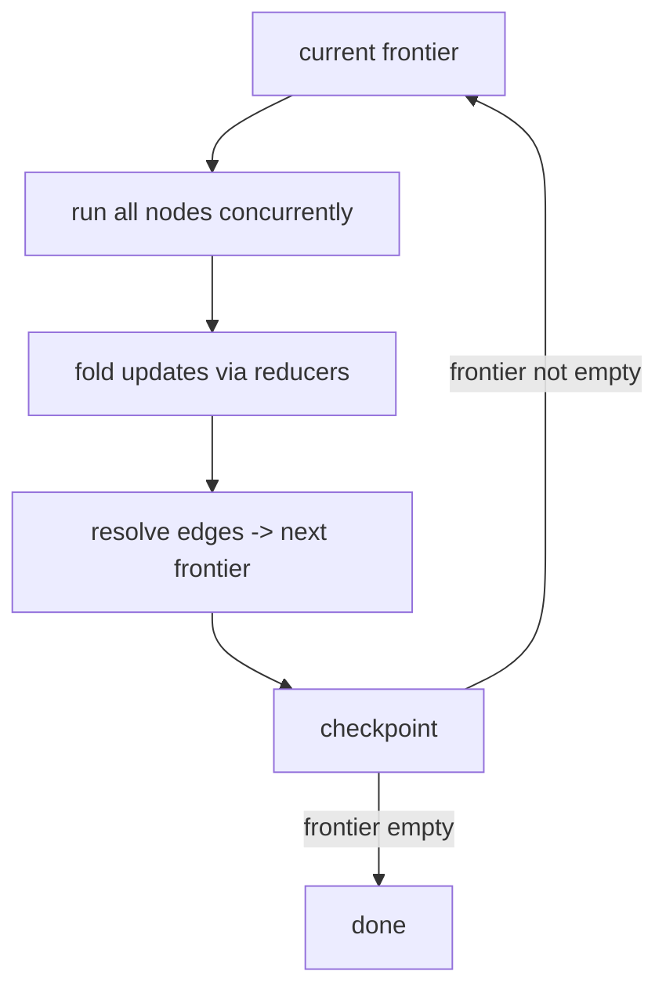

# The execution model

A run advances in super-steps. This is the engine's core loop, and understanding it explains determinism, concurrency, and why a resume never sees a broken state.

## One super-step

Each super-step does four things, in order:

1. Run the current frontier — every node in it, concurrently, against the same immutable state snapshot.
2. Fold each node's partial update into the state through the channel reducers, in a deterministic node order.
3. Resolve the outgoing edges of the nodes that ran to compute the next frontier.
4. Checkpoint the new state and frontier.

Then the next super-step begins with that frontier. The run ends when the frontier is empty (everything routed to `END`).

## All-or-nothing steps

A super-step is atomic. If any node in it raises, the whole step's updates are discarded and no checkpoint is written for that step — the last good checkpoint remains the previous step. A resume therefore never sees a half-applied step: either a super-step committed in full or it did not happen. This is the invariant that makes crash recovery safe.

## Deterministic folding

Updates within a step are folded in a deterministic node order, so non-commutative reducers (`append`, `last`) are well-defined — two nodes appending to the same channel always produce the same order. Commutative reducers (`add`, `union`) are order-independent regardless. Determinism is a property of the reducer plus the fixed order, not luck.

## State isolation

Running several nodes against one shared state raises a question: what if a node mutates a nested container in place? `compile(isolate_state=...)` controls the defensive copy:

- `"fanout"` (default) — deep-copies a node's input only when more than one node runs in the step, so a sibling can't observe an in-place mutation. Linear stretches pay no copy cost.
- `"always"` — copy on every node. Safest, slowest.
- `"never"` — never copy. Fastest; you promise nodes don't mutate shared input in place.

The right habit is simpler than any of these: return updates, don't mutate. Then isolation is just a safety net.

## Bounds and timeouts

- `step_limit` (default 100) caps total super-steps, catching a graph that never reaches `END`.
- `compile(max_node_concurrency=...)` bounds how many nodes run at once within a step.
- A whole-run `timeout` on `invoke` cancels the in-flight step and raises `RunTimeout`; because the previous step is already checkpointed, a checkpointed run resumes from there.

Next: [the Context object](context.md), the handle each node receives.
