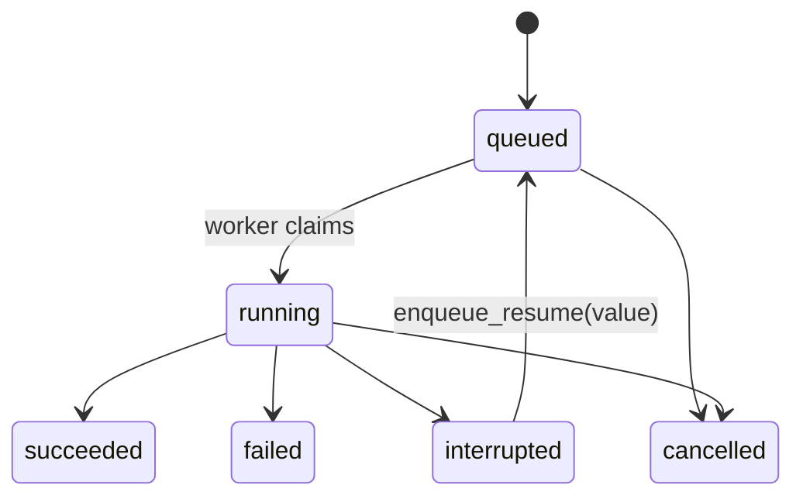

# Control plane

`invoke`, `stream`, and `resume` run a graph inline in your code. The control plane lets you manage runs from outside that process: enqueue a run, let a pool of workers execute it, and list, cancel, or resume it from anywhere sharing the queue. Runs survive a process restart and scale across workers. This chapter covers the pieces and how they fit.

## What it is, and is not

The control plane is a library layer, not a service. There is no bundled HTTP server, auth, or tenancy — those are properties of a service you build on top, and are deliberately out of scope. What you get is the durable machinery: a queue, a registry, and workers, all as plain objects you drive.

## The pieces

- `GraphRegistry` maps a graph name to a compiled-graph factory. Graphs are code, not data, so a run references a graph by name; the enqueuer and its workers share an equivalent registry.
- `RunQueue` holds run requests and hands them to workers under a lease.
- `Worker` / `WorkerPool` claim requests and execute them.

They share one checkpointer so that whichever worker picks up a run sees its state.

## Wiring it up

```python
from agentflow import GraphRegistry, MemoryRunQueue, Worker, FileCheckpointer

cp = FileCheckpointer(".runs")

registry = GraphRegistry()
registry.register("summarize", lambda: build_graph().compile(checkpointer=cp))

queue = MemoryRunQueue()

# Enqueue a run (from anywhere sharing the queue).
run = await queue.enqueue("summarize", {"text": "..."})

# A worker — usually a separate long-running process — drains the queue.
worker = Worker(queue, registry)
await worker.run_once()        # claim and execute one run
# or: await worker.run_forever()

record = await queue.get(run.run_id)   # status, error, timestamps
```

The registry maps the name `"summarize"` to a factory that compiles the graph with the shared checkpointer. The enqueuer only needs the name and the input; the worker resolves the name to real code.

## Run lifecycle

A run moves through these statuses:



- `queued` → `running` when a worker claims it.
- `running` → `succeeded` / `failed` / `interrupted` when the graph finishes, errors, or hits `ctx.interrupt`.
- An `interrupted` run returns to `queued` via `enqueue_resume`.
- A `queued` or `running` run can be `cancelled`.

## Resuming an interrupted run

A graph that interrupts for a human suspends the run as `interrupted`. Re-queue it with the answer and a worker resumes it:

```python
await queue.enqueue_resume(run.run_id, value="approved")   # back to queued
```

The worker detects that the thread sits on an interrupted checkpoint and resumes rather than starting fresh, feeding your value to the waiting node.

## Cancellation

Cancellation is cooperative. `request_cancel` stops a running graph at the next super-step boundary, leaving a consistent checkpoint — never mid-step.

```python
cancelled = await queue.request_cancel(run.run_id)   # True unless already terminal
```

A queued run is cancelled immediately; a running one is flagged, and the worker stops it cleanly at the next boundary.

## Leases and crash recovery

A worker claims a run under a time-bounded lease and renews it with a heartbeat while working. If the worker crashes, its lease expires and another worker re-claims the run. No run is stranded by a dead worker for longer than a lease.

`PostgresRunQueue` claims via `FOR UPDATE SKIP LOCKED`, so under many concurrent workers each run goes to exactly one worker. `MemoryRunQueue` is for a single process and tests.

## Monitoring

Two snapshots let you build a `/healthz` and `/metrics` without any bundled server.

```python
stats = await queue.stats()          # QueueStats
stats.queued, stats.running          # depth by status
stats.expired_leases                 # running runs past their lease — stranded by a crash

pool = WorkerPool(queue, registry, concurrency=4)
await pool.start()
health = pool.health()               # PoolHealth
health.workers, health.alive, health.busy, health.idle
if not health.healthy:
    ...                              # a worker loop died — pool is degraded
```

A rising `expired_leases` is the signal that workers are dying or falling behind their heartbeat. `health.healthy` is False when any configured worker loop is not alive — a readiness signal you can expose directly.

## When to use the control plane

- Use inline `invoke`/`stream` when the run belongs to the calling process — a request handler, a script, a test.
- Use the control plane when runs must outlive the enqueuer, scale across worker processes, or be managed (listed, cancelled, resumed) from elsewhere.

Next: [observability](observability.md).
