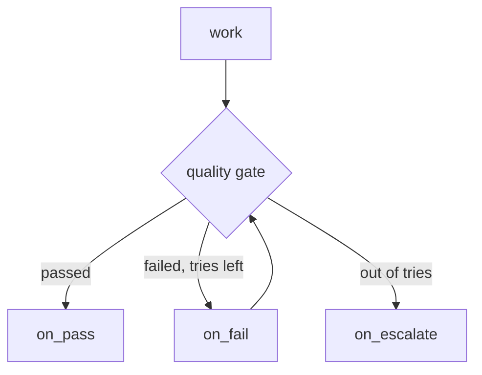

# Quality gates

A long autonomous run needs a way to ask "is this good enough?" and act on the answer — accept the work, send it back for another pass, or stop and get a human. That checkpoint is a quality gate. AgentFlow expresses it not as a new kind of node or a new backend, but as a thin convention over primitives you already have: a decision function, a three-way conditional edge, and a per-gate attempt counter. The rule it enforces is the one that keeps long runs debuggable — a work node writes an artifact, and a separate gate decides what happens next.

## The contract

A gate is one dataclass and one helper. The evaluator returns a `GateResult`; `add_quality_gate` wires it into the graph with routing and an attempt budget.

```python
from agentflow import END, Graph, last
from agentflow.prebuilt import GateResult, GateState, add_quality_gate
from typing import Annotated

class ReviewState(GateState):
    artifact: Annotated[str, last]

async def evaluate(state, ctx) -> GateResult:
    score = await grade(state["artifact"])
    return GateResult(
        passed=score >= 0.85,
        score=score,
        feedback=None if score >= 0.85 else "add error handling",
    )

g = Graph(ReviewState)
g.add_node("revise", revise)
g.add_node("publish", publish)
g.add_node("ask_human", ask_human)
add_quality_gate(
    g, "review", evaluate,
    on_pass="publish", on_fail="revise", on_escalate="ask_human",
    max_attempts=3,
)
g.add_edge("revise", "review")   # revise loops back into the gate
```

`GateResult` carries a verdict plus context for humans and revise nodes:

```python
GateResult(
    passed,            # the only field routing needs
    score=None,        # for observability / thresholds
    reasons=[],        # why it failed, for logs and human review
    feedback=None,     # actionable text a revise node can act on
)
```

## The three routes

Every gate routes exactly one of three ways, and all three targets are required — a gate never silently ships a failing artifact once it runs out of attempts.

| Outcome | Route | Typical target |
| --- | --- | --- |
| `passed` is true | `on_pass` | the next real step, or `END` |
| failed, attempts remain | `on_fail` | a revise node that loops back into the gate |
| failed at `max_attempts` | `on_escalate` | a human-in-the-loop node, or a park-and-report node |



The gate keeps its attempt count in the `gate_attempts` channel and its last verdict in `gate_results`, both provided by the `GateState` mixin. One pair of channels serves any number of gates in a graph — the gate name is the key — so you never declare per-gate fields.

## GateResult vs Candidate

AgentFlow has two "is it good enough?" types, and they are not duplicates — they answer different questions, so pick by what you are building.

| | `Candidate` | `GateResult` |
| --- | --- | --- |
| Produced by | the worker in [`iterate_until_converged`](../patterns/prebuilt.md) | an evaluator in `add_quality_gate` |
| Key field | `done` — "the loop may stop" | `passed` — "this meets the bar" |
| Who owns the decision | the loop (best-so-far, patience, max iterations) | the gate (pass / revise / escalate) |
| Shape | a self-contained optimize loop with a score to climb | an explicit checkpoint in a larger graph that routes three ways |

Use `iterate_until_converged` when the whole task *is* "keep improving until good enough". Use `add_quality_gate` when a gate is one station in a bigger workflow that may hand off to a human. They compose: a gate's `on_fail` can point at a revise node that is itself a small loop.

## Seeing gates in telemetry

A gate emits a `GateEvent` through `ctx.emit` on every decision: `started`, then one of `passed` / `failed` / `escalated`, each carrying the gate name, attempt number, score, and reasons. So your [observability](observability.md) sinks show exactly where a process looped on quality and why it escalated — no manual logging.

```python
from agentflow import GateEvent, Hooks

class GateLog(Hooks):
    async def on_event(self, thread, step, node, event):
        if isinstance(event, GateEvent):
            print(f"{event.gate} {event.phase} attempt={event.attempt} score={event.score}")

app = g.compile(hooks=GateLog())
```

In a `JsonlTelemetry` trace these arrive as `event` lines with `eventType: "GateEvent"` and the phase and attempt in the payload — a durable record of every gate decision in the run.

## Escalating to a human

When a gate escalates, the natural `on_escalate` target is a node that suspends the run for a person. Pair it with the structured [interrupt convention](human-in-the-loop.md): send a `QualityGateReview` so the reviewer sees the artifact, the criteria, and the machine's own assessment.

```python
from agentflow.interrupts import QualityGateReview

async def ask_human(state, ctx):
    result = state["gate_results"]["review"]
    decision = await ctx.interrupt(QualityGateReview(
        artifact=state["artifact"],
        criteria=["tests green", "no secrets", "API stable"],
        auto_score=result.score,
        reasons=result.reasons,
        gate="review",
    ).to_payload())
    return {"approved": decision == "accept"}
```

Because the payload has a `type` discriminator, a UI or control-plane worker can switch on `interrupt_type(payload)` and render the right prompt. See [human-in-the-loop](human-in-the-loop.md) for the resume mechanics.

## A complete example

`examples/quality_gate.py` is a runnable version of a draft → gate → revise/publish/escalate loop, and `examples/research_plan_implement_review.py` shows two gates guarding a longer `research → plan → implement → review` workflow. The [long-running loops](../patterns/long-running-loops.md) chapter walks through those shapes and the idempotency recipe that keeps the expensive steps from re-running.
