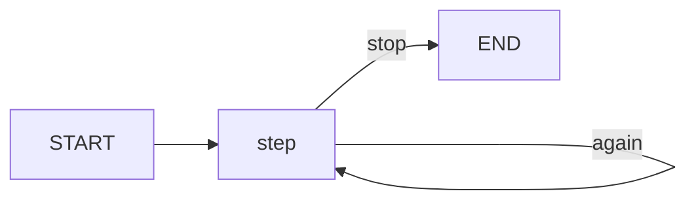
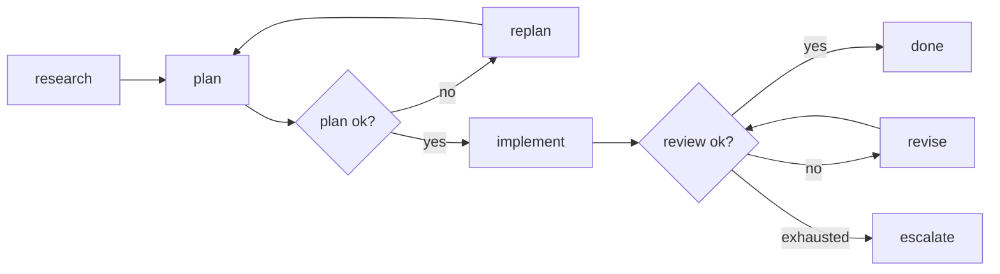
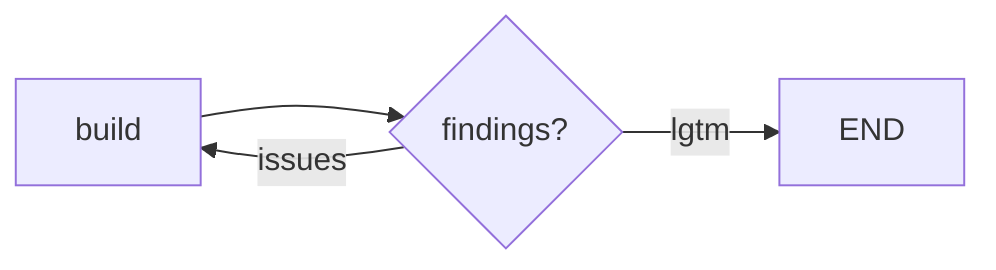
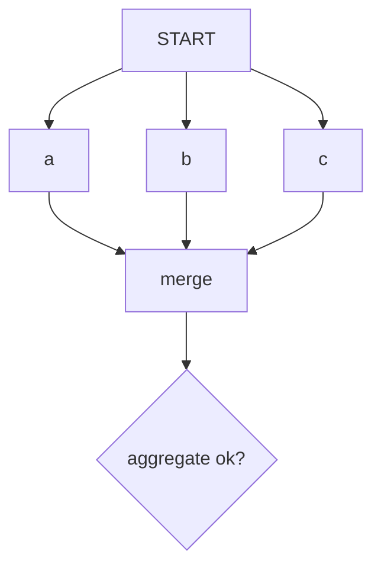

# Long-running loops

Long autonomous processes — the kind you kick off and let run for minutes or hours — tend to reuse the same handful of skeletons. This chapter documents them as recipes built from the primitives, not as new engine features. The through-line is one discipline: a work node writes an artifact, and a separate gate or router decides what happens next. Keep those apart and your run stays debuggable, and a resume after a crash stays predictable.

## Recipe: optimize / improve

Draft, score, redraft until good enough. This is exactly what [`iterate_until_converged`](prebuilt.md) does — one `work` function returning a `Candidate`, and the loop owns best-so-far, patience, and the stop decision.



Reach for this when the whole task is "keep improving one artifact against one score". When you instead need an explicit accept / revise / escalate decision inside a bigger graph, use a [quality gate](../durability/quality-gates.md).

## Recipe: research → plan → implement → review

The workhorse shape for a gated pipeline. Two [quality gates](../durability/quality-gates.md) guard the risky transitions: a plan gate makes sure the plan is sound before any work happens, and a review gate checks the result.



Two rules make this safe to run unattended:

- `plan` and `review` are the natural human-gate or hard-evaluator points. Escalate there, not from the middle of `implement`.
- `implement` should be narrow and idempotent, so a resume after a crash re-runs it safely. Wrap it with [`skip_if_done`](#recipe-idempotency-skip-work-already-done) so an identical plan does not rebuild.

`examples/research_plan_implement_review.py` is a runnable version.

## Recipe: critic / adversarial loop

Two roles, one artifact. A builder produces work; a critic returns structured findings but never edits. The builder fixes; the critic re-checks. Stop when the critic signs off or a step budget is spent.



Model the critic as an evaluator returning a `GateResult` whose `reasons` carry the findings and whose `feedback` tells the builder what to fix. The builder reads `state["gate_results"][...]` on the next pass. This keeps "judge" and "fix" in separate nodes — the same discipline as every other recipe here.

## Recipe: fan-out / map-reduce with a gate on the aggregate

Run several independent branches — different hypotheses, files, or test suites — then merge and gate the combined result.



Two things matter here. First, reducers do the merging: give the aggregate channel an `append` or `merge` reducer so the parallel updates fold together deterministically instead of racing. Second, a super-step is all-or-nothing — if any branch raises, the whole step is discarded and no checkpoint is written, so a resume never sees a half-merged aggregate. Bound the fan-out with `compile(max_node_concurrency=...)` if the branches hit a shared resource.

## Recipe: budget-aware stopping

An autonomous run needs a ceiling — a router that stops not only on quality but on cost. Keep the budget where it belongs: `attempts` is a decision input that must survive a resume, so it lives in state; wall-clock time and token counts are non-deterministic, so keep them in [`RunMetrics`](../durability/observability.md) or your own hook rather than in the checkpoint. Putting a timestamp in state means a resume would "replay" a time from the past and mislead the router.

```python
from typing import Annotated
from agentflow import add, last

class BudgetState(GateState):
    attempts: Annotated[int, add]      # survives resume — safe to route on

def route(state):
    result = state["gate_results"].get("review")
    if result and result.passed:
        return "done"
    if state.get("attempts", 0) >= 10:   # hard budget ceiling
        return "escalate"
    return "revise"
```

A quality gate already enforces a per-gate `max_attempts`; this recipe is for a budget that spans several nodes or the whole run.

## Recipe: idempotency, skip work already done

Long loops re-run the same steps — after a crash, on resume, or on another iteration. Expensive, deterministic work should run once per distinct input. [`skip_if_done`](../reference/api/gate.md) is a recipe over the [Store](../durability/store.md): hash the node's input, serve a cached result if one exists under that hash, otherwise run and cache.

```python
from agentflow import MemoryStore
from agentflow.prebuilt import artifact_key, skip_if_done

store = MemoryStore()   # or PostgresStore for a durable, shared cache

async def expensive(state, ctx):
    return {"result": await do_costly_thing(state["input"])}

node = skip_if_done(
    expensive, store,
    namespace=("cache", "expensive"),
    key_from=lambda s: artifact_key(s["input"]),
)
g.add_node("expensive", node)
```

`artifact_key` is a stable SHA-256 of any JSON-serializable value (dict order does not matter), so it keys by *what* the input is rather than when it ran. Because the cache is a `Store`, a `PostgresStore` shares it across processes and a `ttl` expires stale entries. Only wrap deterministic work whose result depends solely on the hashed input — a node with side effects you always want is a poor fit.

## The one rule behind all of these

Do not mix "the work" and "the decision to continue" in one node. The work node writes an artifact; a gate or router reads state and decides. That separation is what makes each super-step atomic, each checkpoint meaningful, and each resume predictable — the properties a run needs to survive being left alone for an hour.

Next: the [quality gates](../durability/quality-gates.md) chapter for the gate contract in full, or the [tutorial](tutorial-qa-agent.md) for an end-to-end agent.
