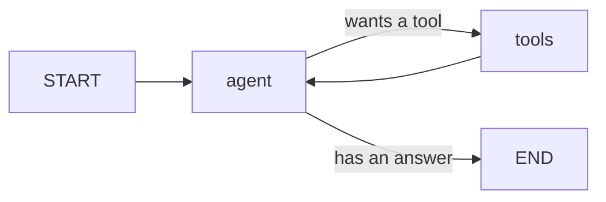

# Tutorial: a documentation Q&A agent

This is the payoff chapter. We'll build a small but complete agent that answers questions about a body of documentation: it searches the docs, reads the hits, and writes a grounded answer — calling tools in a loop until it's done. Along the way we'll wire in streaming, durability, and a human approval step, so the pieces from earlier chapters come together in one program.

Nothing here is new machinery. It's the [`tool_loop`](prebuilt.md) pattern with real tools, plus a checkpointer and an interrupt.

## What we're building



The model drives. When it wants to search or read, it emits a tool call; our graph runs the tool and feeds the result back; the loop continues until the model answers without asking for a tool.

## 1. The tools

Two tools over an in-memory corpus. A tool is just a callable plus a schema.

```python
DOCS = {
    "state": "State is typed channels, each with a reducer that folds updates.",
    "backends": "A backend is how a node talks to a model or an agent.",
    "checkpointing": "A checkpointer persists each super-step so a run can resume.",
}

async def search_docs(query: str) -> str:
    hits = [k for k, v in DOCS.items() if query.lower() in (k + " " + v).lower()]
    return "matches: " + (", ".join(hits) or "none")

async def read_doc(doc_id: str) -> str:
    return DOCS.get(doc_id, f"no document {doc_id!r}")
```

Wrap each in a `Tool` with a JSON-Schema for its arguments:

```python
from agentflow.prebuilt import Tool

tools = [
    Tool("search_docs", search_docs,
         description="Search the documentation; returns matching doc ids.",
         schema={"type": "object",
                 "properties": {"query": {"type": "string"}},
                 "required": ["query"]}),
    Tool("read_doc", read_doc,
         description="Read one document by its id.",
         schema={"type": "object",
                 "properties": {"doc_id": {"type": "string"}},
                 "required": ["doc_id"]}),
]
```

## 2. The backend and the loop

```python
from agentflow import Message
from agentflow.backends.ollama import OllamaBackend
from agentflow.prebuilt import tool_loop

llm = OllamaBackend("llama3.2")
app = tool_loop(llm, tools, max_turns=8)
```

## 3. Run it

```python
import asyncio

async def main():
    question = "How does state work in this framework?"
    async with llm:
        out = await app.invoke({"messages": [Message("user", question)]})
    if out["status"] != "completed":
        print("unresolved — ran out of turns with tools pending")
        return
    print(out["messages"][-1].content)

asyncio.run(main())
```

The agent will typically call `search_docs("state")`, then `read_doc("state")`, then answer. We check `status` before trusting the last message.

## 4. Stream the answer

Build with `stream_text=True` and stream the compiled graph; a `backend` event carries a `TextChunk` to print.

```python
from agentflow import TextChunk, ToolCall

app = tool_loop(llm, tools, max_turns=8, stream_text=True)

async with llm:
    async for ev in app.stream({"messages": [Message("user", question)]}):
        if ev.kind == "backend" and isinstance(ev.data, TextChunk):
            print(ev.data.text, end="", flush=True)
        elif ev.kind == "backend" and isinstance(ev.data, ToolCall):
            print(f"\n[calling {ev.data.name}({ev.data.args})]")
```

## 5. Make it durable

Give the loop a [checkpointer](../durability/checkpointing.md) and name the run with a `thread`; if the process dies mid-answer, a fresh process resumes it.

```python
from agentflow import SqliteCheckpointer

app = tool_loop(llm, tools, max_turns=8, checkpointer=SqliteCheckpointer(".runs/qa.db"))

async with llm:
    await app.invoke({"messages": [Message("user", question)]}, thread="q-1")

# later, elsewhere, same checkpointer:
async with llm:
    out = await app.resume("q-1")
```

## 6. Approve tool use with a human in the loop

To require sign-off before a sensitive tool runs, switch to an [agent backend](../backends/agent-backends.md) with the [`Interactive`](../backends/permissions.md) policy — every tool request then pauses the run for approval, using the [human-in-the-loop](../durability/human-in-the-loop.md) machinery.

```python
cp = await app.get_state("q-1")
if cp.interrupted:                    # a PermissionRequest is waiting
    req = cp.interrupt_payload
    await app.resume("q-1", value="allow" if trusted(req.tool) else "deny")
```

## Where to go next

You've used every layer in one agent: the graph engine, an LLM backend and a tool loop, streaming, a durable checkpointer, and a human approval gate. From here:

- Run these as background jobs across a worker pool — the [control plane](../durability/control-plane.md).
- Add memory that outlives a question — the [Store](../durability/store.md).
- Gate the answer on quality before shipping — [quality gates](../durability/quality-gates.md).
- Exact signatures — the [API cheatsheet](../reference/api.md).
